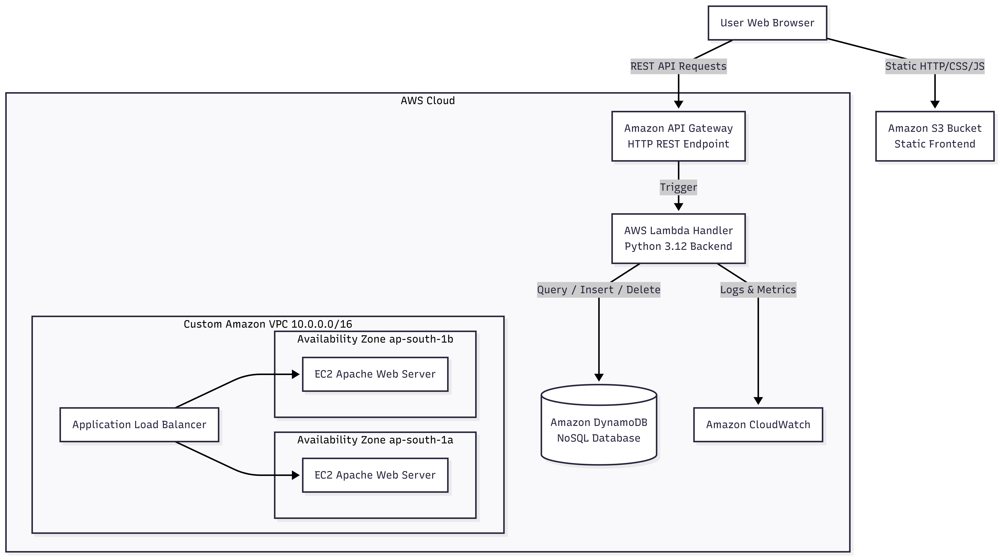

# Cloud-Native Serverless & Scalable Student Portal

An end-to-end, highly available, fault-tolerant, and cost-effective cloud application deployed on Amazon Web Services (AWS). This architecture features a serverless API backend, NoSQL database persistence, static web hosting on Amazon S3, and auto-scaling compute instances across multiple Availability Zones inside a custom Amazon VPC.

---

## 🏗️ Architecture Overview



### Key AWS Infrastructure Components
* **Networking:** Custom AWS VPC (`10.0.0.0/16`) spanning multiple Availability Zones (`ap-south-1a`, `ap-south-1b`) with isolated public subnets, Internet Gateways, and route tables.
* **Frontend:** Amazon S3 Static Website Hosting delivering a responsive Bootstrap 5 application interface with dynamic API configuration and real-time record synchronization.
* **API Tier:** Amazon API Gateway (HTTP API v2) handling REST requests (`GET`, `POST`, `DELETE`, `OPTIONS`) with full CORS enabled.
* **Compute / Serverless:** AWS Lambda (Python 3.12) for event processing and business logic execution.
* **Database Tier:** Amazon DynamoDB (NoSQL key-value store) running on On-Demand capacity mode (`StudentData` table).
* **Scalability & Load Balancing:** Elastic Compute Cloud (EC2) instances behind an Application Load Balancer (ALB) managed by an Auto Scaling Group (ASG).
* **Security & Observability:** Granular AWS IAM roles/policies, Security Groups restricting ingress to ALB, and CloudWatch execution metrics.

---

## 📁 Repository Structure

```text
cloud-student-portal/
├── frontend/
│   └── index.html           # S3 Static Web Application (Bootstrap 5 + JS)
├── terraform/
│   ├── main.tf              # Provider, VPC, S3, DynamoDB, Lambda, API Gateway, ALB & ASG resources
│   ├── variables.tf         # Configurable input parameters
│   └── outputs.tf           # Infrastructure deployment outputs (S3 URL, API Endpoint, ALB DNS)
├── backend/
│   └── lambda_function.py   # Serverless Python 3.12 CRUD handler
├── scripts/
│   └── ec2_user_data.sh     # EC2 startup bash script installing Apache HTTP server
└── docs/                    # Architectural diagrams and documentation
```

---

## ⚡ API Endpoints Specification

| HTTP Method | Route | Request Body | Description |
| :--- | :--- | :--- | :--- |
| `GET` | `/` | *None* | Fetch all student records from DynamoDB table |
| `POST` | `/` | `{ "student_id": "...", "name": "...", "email": "...", "course": "..." }` | Add or update a student record in DynamoDB |
| `DELETE` | `/` | `{ "student_id": "..." }` | Delete a student record by `student_id` |
| `OPTIONS` | `/` | *None* | CORS Preflight check response |

---

## 🚀 Deployment Instructions

### Prerequisites
* [Terraform CLI](https://www.terraform.io/downloads) (>= 1.5.0) installed.
* [AWS CLI](https://aws.amazon.com/cli/) configured with valid AWS credentials (`aws configure`).

### Deployment Steps
1. **Clone Repository & Navigate to Terraform Directory:**
   ```bash
   cd terraform
   ```

2. **Initialize Terraform Workdir:**
   ```bash
   terraform init
   ```

3. **Plan Infrastructure Changes:**
   ```bash
   terraform plan
   ```

4. **Deploy Resources to AWS:**
   ```bash
   terraform apply -auto-approve
   ```

5. **Access Endpoints:**
   - **Frontend S3 Website:** Check output `s3_website_url`
   - **Backend API Gateway:** Check output `api_gateway_endpoint`
   - **ALB DNS Name:** Check output `alb_dns_name`

---

## 👤 Author & Training Context

* **Developer:** Abhishek Singh (Roll No: 1230438004)
* **Degree:** B.Tech in Computer Science & Engineering, Babu Banarsi Das University
* **Training Program:** 90-Hour AWS Cloud Computing Training at GRAStech
* **Technical Guide:** Rudra Prakash Yadav
